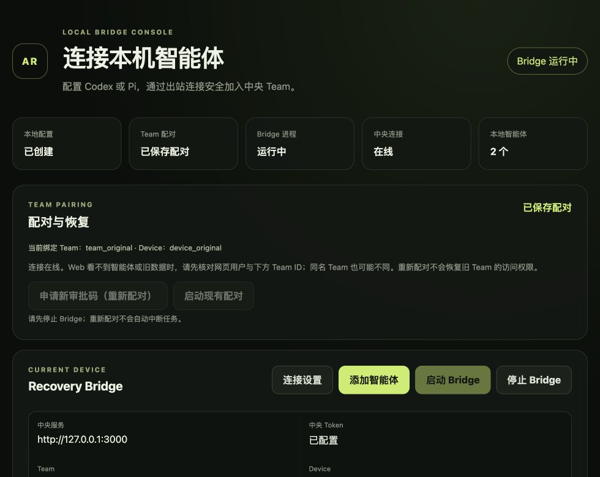
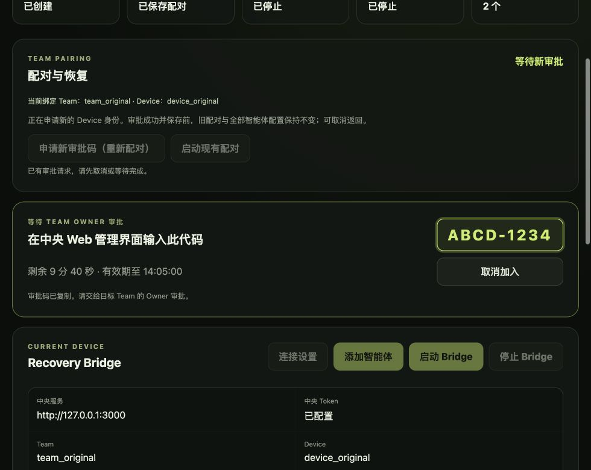

# BRG-030: Local GUI pairing and recovery acceptance

Date: 2026-08-26. Scope: the shared Bridge Console assets and local service used
by the native desktop shell. Ownership is defined in
[ADR-0017](../adr/0017-isolate-explicit-bridge-reenrollment.md) and the
[Bridge module](../modules/bridge.md#explicit-gui-pairing-recovery).

## Automated evidence

- `go test ./...`: Bridge suite passes, including authenticated re-enrollment,
  explicit consent, stale Device rejection, stopped-and-drained execution,
  probe fencing, cancellation and late callbacks, expiry, and new identity
  activation. Normal test runs skip the opt-in browser fixture.
- `go test -race ./internal/console ./internal/connection`: passes. A gated
  WebSocket Run proves shutdown waits for its canceled worker to finish.
- Fault injection covers backup, credential, Agent identity, and active-config
  save failures; changed on-disk configuration; and incomplete approval data.
  These cases retain the previous binding. Reopening the new active config and
  the previous-config backup selects their respective identities.
- Assertions verify owner-only staged files, no old inbox/session/epoch reuse,
  preserved Runtime configuration, and no credential values in public state.
- `npm run test:bridge-ui`: eight tests pass, including invalid/expired codes
  and a completed request not resurfacing after its old expiry deadline.
- `go vet ./...` and
  `go test -tags desktop ./cmd/agentroom-bridge-desktop`: pass. The macOS linker
  reports host-SDK deployment-target warnings; compilation still succeeds.
- `npm test`, `npm run build`, and `npm run validate`: pass. Validation covers
  seven schemas and 56 fixtures; no wire schema changes were needed.
- `npm run test:e2e`: three deterministic cross-process scenarios pass; the
  explicitly opt-in live Codex/Pi scenario is skipped. This is regression
  coverage, not a new live native re-enrollment claim.

## Isolated browser acceptance

The browser uses the actual embedded Console UI and local HTTP handlers with
temporary configuration, fake Device credentials, and injected enrollment and
Bridge connections. It never approves a real central Device or invokes a live
Runtime. The fixture is available only in a Go test:

```sh
cd bridge
AGENTROOM_PAIRING_UI_FIXTURE=1 go test ./internal/console \
  -run '^TestPairingBrowserFixture$' -v -count=1 -timeout=21m
```

Open the printed loopback URL. The fixture-only POST routes `/fixture/expire`,
`/fixture/fail`, `/fixture/approve`, and `/fixture/stop` drive the corresponding
test states; they are not compiled into the product binary.

Verified in the browser at the desktop shell's 980 by 780 initial viewport:

1. Paired/online state keeps the Team and Device binding visible and explains
   why a different Web user or same-name Team may not show the Agents.
2. Stopping the mock Bridge enables the new-code action. Confirmation explains
   new Device/Agent identities and preservation of the previous data.
3. Pending approval displays a copyable code and countdown. Copying reports
   success. Starting the Bridge, editing configuration, and Runtime probes are
   disabled while approval is pending.
4. Expiry disables copying, clears the copy hint, and exposes re-application.
   Canceling returns to the previous saved binding; retrying requests a code.
5. A simulated failure keeps the original binding and gives recovery guidance.
   A subsequent simulated approval selects the new identity, shows the backup
   path, and starts the mock connection.
6. No horizontal page overflow was observed. No browser warning/error logs
   occurred during the completed failure/retry/success walkthrough.

Screenshots contain only fixture identities and a fake approval code:





## Acceptance boundary

The changed paths have focused and race coverage; the existing cross-process
suite remains green. The shared UI was exercised in a real browser and the
native shell was compiled/tested, not interactively reinstalled or launched.
The final consumed-deadline guard has automated coverage; the browser captures
precede that nonvisual guard change.

This does not certify a new published release, physical native-app acceptance,
power-loss durability, or a new real central re-enrollment E2E. No installed
Bridge was upgraded and no user pairing was reset for this acceptance.
Restoring a Web user's old Team access is a separate Owner authorization
operation, not part of re-enrollment.
