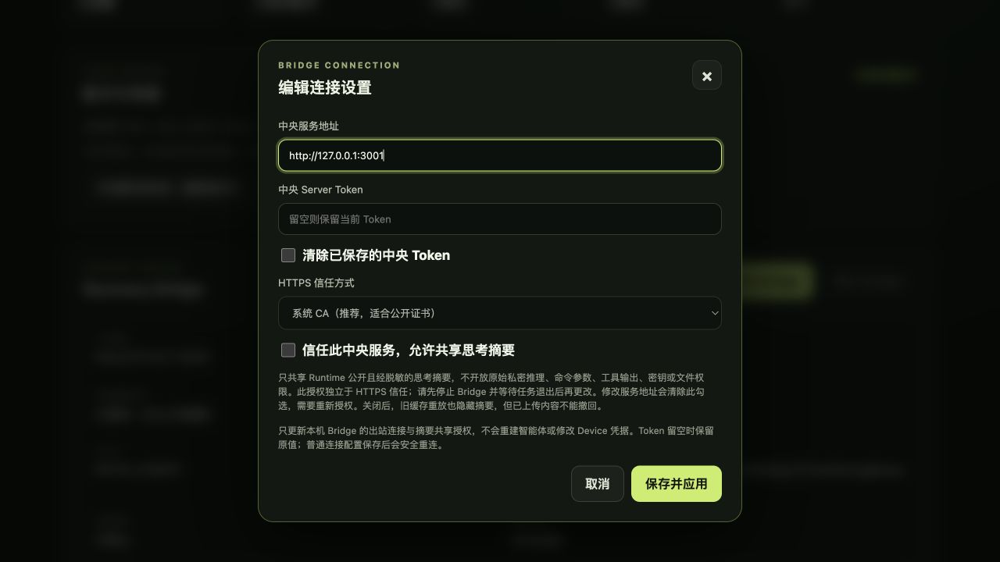

# BRG-031: Local reasoning-summary consent

Date: 2026-08-26. The implementation follows
[ADR-0018](../adr/0018-local-reasoning-summary-consent.md).

## Evidence

- Full Bridge `go test ./...` passes. New tests cover missing/false/true consent,
  config round trips, authenticated updates, running/draining rejection, failed
  saves, endpoint changes, and preservation of unrelated Runtime settings.
- Executor tests prove default-off summaries are neither persisted nor sent;
  replies, output, tools, and terminal status keep contiguous sequences. Restart
  recovery with consent withdrawn masks old summaries and their labels/IDs
  without rewriting local history or creating a sequence gap.
- `go test -race ./internal/console ./internal/delivery ./internal/connection`
  and `go vet ./...` pass.
- `go test -tags desktop ./cmd/agentroom-bridge-desktop` passes with the existing
  host-SDK deployment-target linker warnings.
- `npm run test:e2e` passes four deterministic scenarios, including a real Go
  Bridge with default-off consent and one with explicit consent. Both complete
  streaming, final replies, Artifact publication, and cancellation. The live
  Codex/Pi scenario remains explicitly skipped.
- `npm run test:bridge-ui`, `npm run lint:docs`, and `git diff --check` pass.

## Browser acceptance

The opt-in `TestPairingBrowserFixture` serves the actual shared GUI with fake
credentials and a mock connection. No real pairing, Runtime, or installed App
is changed. The browser verified:

1. Existing config without the field displays summary sharing as unauthorized.
2. Enabling while running is rejected with a stop-and-drain explanation.
3. Stopping the mock Bridge, enabling, saving, and reopening retains consent.
4. Editing the server address clears the checkbox; this draft is not saved.
5. The permission is visibly distinct from HTTPS trust and explains what
   remains private and that uploaded information cannot be recalled.

The 1280 by 720 screenshot has no horizontal overflow:

This is local shared-GUI acceptance plus native compilation, not a published
release or interactive acceptance of an installed native package.
