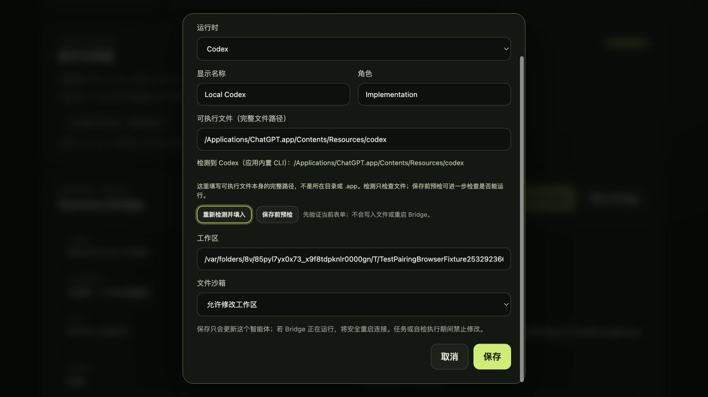
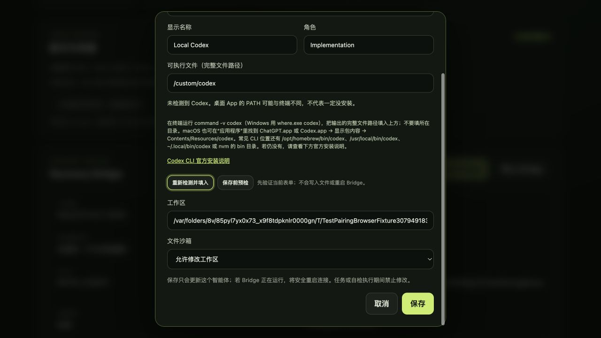

# BRG-032: Desktop Runtime executable discovery

Date: 2026-08-26. Ownership follows
[ADR-0019](../adr/0019-bounded-local-runtime-discovery.md).

## Root cause and behavior

The old Console used only `exec.LookPath` during startup. A desktop process
can lack the terminal's PATH entries even when a CLI is installed. On this
machine, terminal lookup resolved the executable inside ChatGPT.app; lookup
under a minimal system PATH found nothing. The former detected-value action
also replaced a manually entered path with an empty string on a miss.

Discovery now checks PATH and bounded app/common-bin/nvm locations. It reports
the source, can be explicitly refreshed, never runs the discovered program,
and never clears a draft on a miss. The UI explains full executable paths,
terminal lookup, app package contents, and links to the
[official Codex CLI installation page](https://learn.chatgpt.com/docs/codex/cli).
These are navigation hints, not an automatic installation action or a claim
that detecting a file proves the Runtime is ready.

## Verification

- Full Bridge `go test ./...`, Console race tests, and `go vet ./...` pass.
  Fixtures cover PATH priority, app fallback, invalid/non-executable candidates,
  normal symlink installations, known common locations, numeric nvm ordering,
  authenticated explicit refresh, no polling scans, and unchanged config and
  Bridge lifecycle.
- `npm run test:bridge-ui` passes twelve tests, including four new path/help
  projections and preservation of manually entered paths.
- `npm test`, `npm run build`, `npm run validate`, and docs lint pass. Seven
  schemas and 56 fixtures remain unchanged.
- Desktop-tag compilation/tests pass, with the existing macOS host-SDK
  deployment-target warnings.

## Isolated browser acceptance

Run the existing opt-in `TestPairingBrowserFixture` with
`AGENTROOM_DISCOVERY_FIXTURE=fallback` to simulate missing PATH lookup while
using real known-location checks, or `AGENTROOM_DISCOVERY_FIXTURE=missing` for
an empty result. Both retain fake credentials and a mock Bridge connection.

The browser verified the actual app-bundled Codex path was detected and copied
into the new-Agent draft without saving or executing it. The missing fixture
showed terminal/app-location instructions and the official installation link;
clicking re-detect preserved `/custom/codex`. Switching to Pi selected Pi
instructions and hid the Codex installation link. Neither state had horizontal
page overflow at 1280 by 720. The long modal uses its existing vertical scroll.

This is shared-GUI browser acceptance and native compilation, not a release,
installation, live Runtime invocation, or a change to the user's current
Agent configuration.
