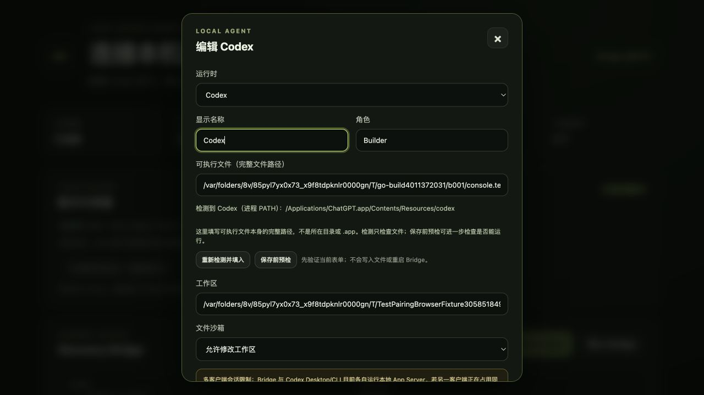
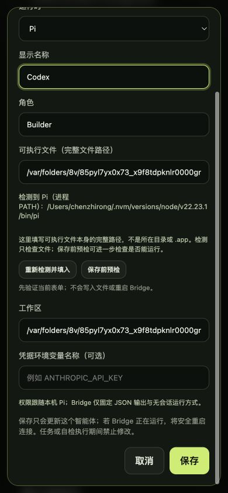

# BRG-034: Selection-scoped Runtime policy descriptions

Date: 2026-08-26.

## Behavior

The Console previously kept both the Codex session-ownership warning and the
Pi permission policy in the per-Agent selector's `aria-describedby` value.
CSS hid the inactive paragraph visually, but hidden referenced text can still
participate in accessible description calculation.

The active Runtime now owns the complete description relationship:

- Codex selects only `agent-codex-session-ownership-policy`;
- Pi selects only `agent-pi-permission-policy` and hides the Codex warning;
- disabling Codex during first enrollment removes the hidden Codex policy from
  the checkbox's `aria-describedby` value; and
- re-enabling Codex restores that association.

The visible policy wording, configuration persistence, Runtime permissions,
and execution behavior are unchanged.

## Automated verification

- `runtime-policy.test.mjs` exercises both Agent Runtime transitions and the
  enrollment Codex enabled/disabled transition against DOM-like controls.
- The embedded Console regression verifies the initial single-description
  markup and rejects the former dual-description value.
- Full Bridge, Console race, Vet, Bridge UI, desktop-tag compilation, and docs
  checks remain the completion gates recorded by `BRG-034`.

## Isolated browser acceptance

The existing fake-credential `TestPairingBrowserFixture` served the real
embedded Console without central network calls or saving form changes.

At the default 1280 by 720 viewport, editing the Codex Agent produced
`aria-describedby=agent-codex-session-ownership-policy`; the Codex warning was
visible, the Pi policy was hidden, and page `clientWidth` equaled `scrollWidth`
at 1280. Switching the same selector to Pi produced
`aria-describedby=agent-pi-permission-policy`; the Codex warning disappeared
from the rendered DOM snapshot and only the Pi policy remained visible.

After applying the explicit 390 by 844 browser viewport and reloading the
fixture, the Pi state retained the same single description. Page `clientWidth`
and `scrollWidth` both measured 390, and the scrollable modal kept the Pi policy
and save controls readable without horizontal overflow.

This is isolated local GUI acceptance and does not change the owner's real
Bridge configuration, start a Runtime, connect to a central Team, or validate a
packaged release.
