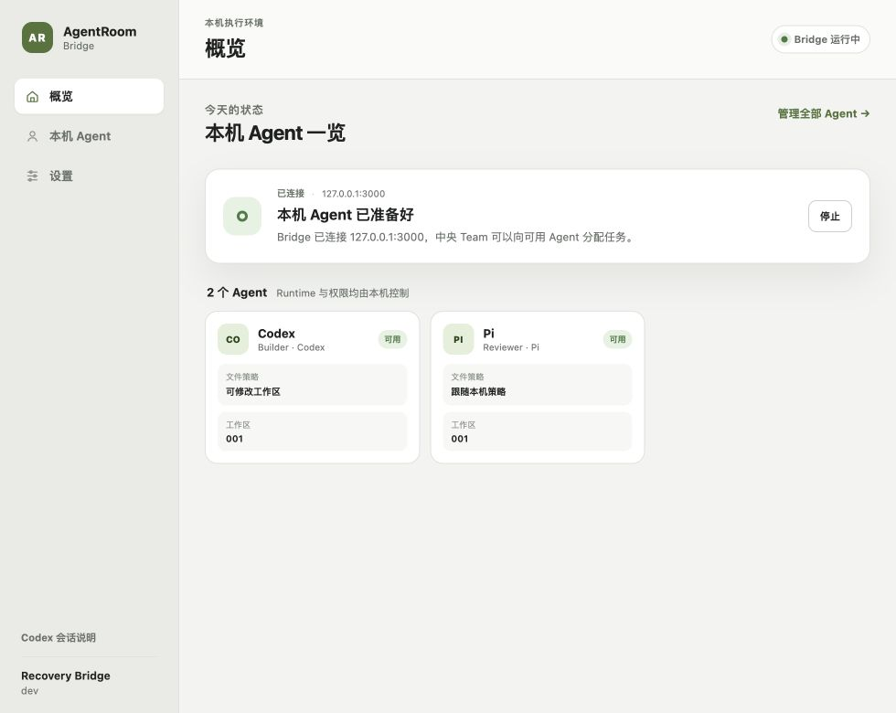
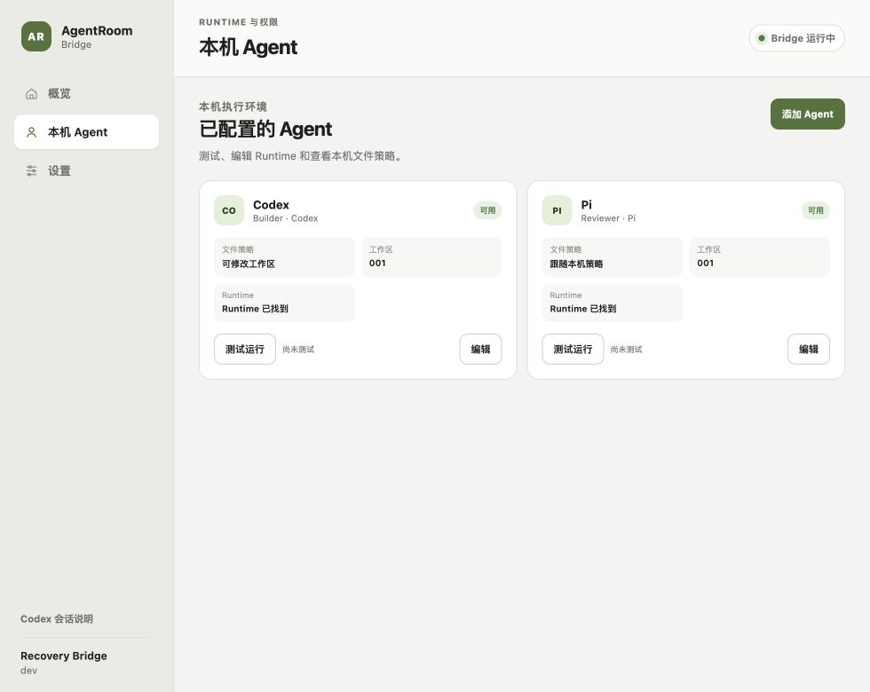
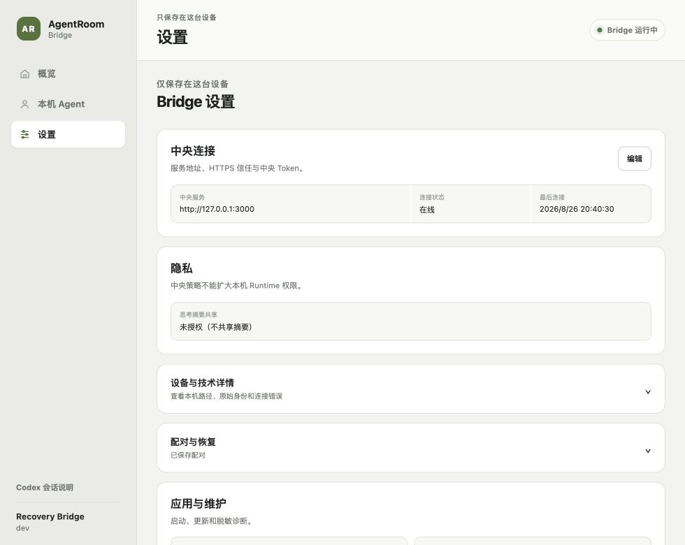
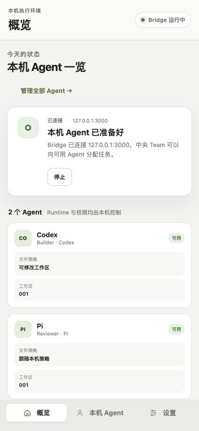
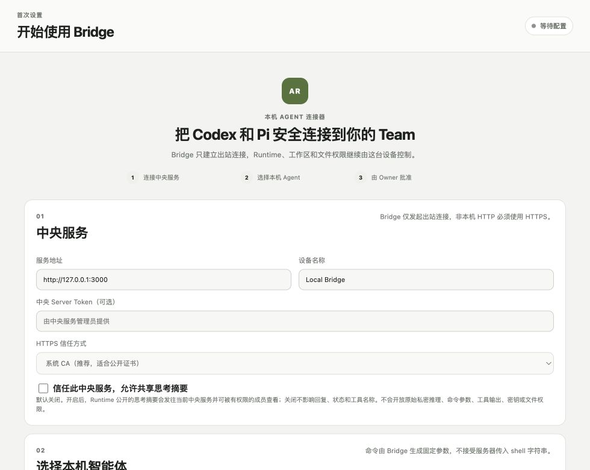
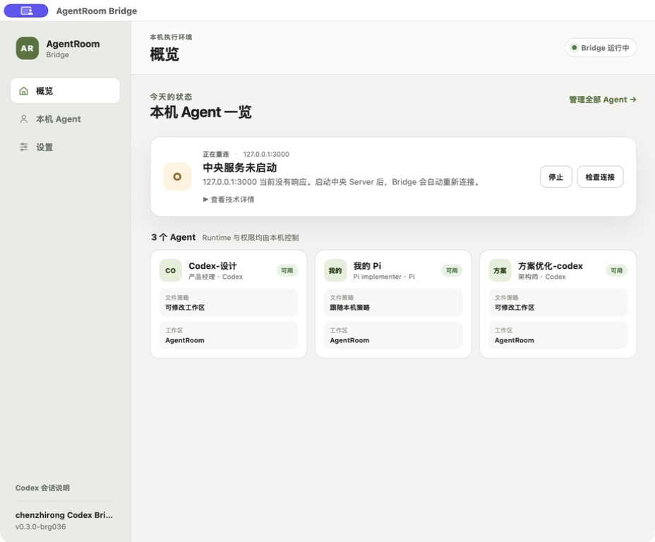
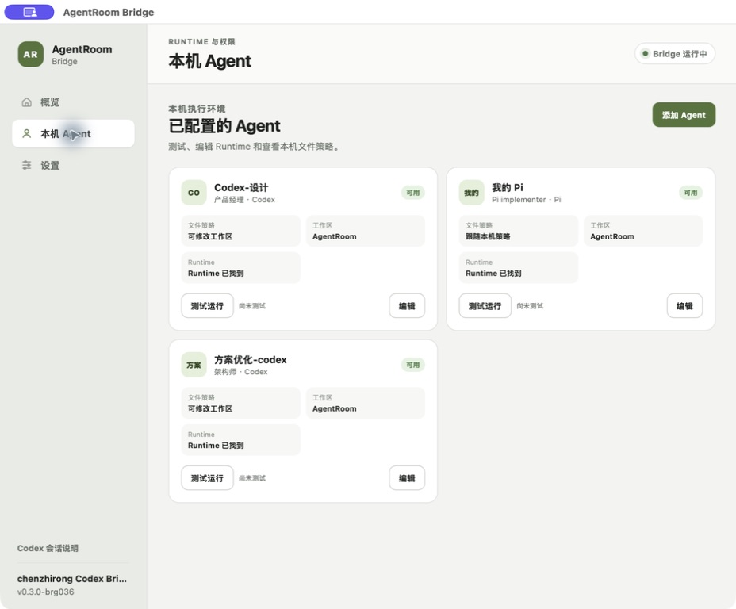

# BRG-036 Productized Bridge Shell Acceptance

## Scope

`BRG-036` replaces the paired Bridge Console's engineering dashboard with a
product-oriented desktop shell. The configured experience now separates:

- Overview for connection health, recovery guidance, and configured Agents;
- Agents for Runtime availability, test/edit actions, Workspace basename, and
  bounded local filesystem policy; and
- Settings for connection, privacy, technical identity, pairing recovery,
  startup, updates, and diagnostics.

First enrollment remains a focused setup flow. The change does not alter the
authenticated Console API, Bridge lifecycle, pairing identity, credentials,
Runtime commands, Workspace authority, or central wire contracts.

## Automated evidence

- `npm run test:bridge-ui` passes 21 presentation, pairing, discovery, Runtime
  policy, and session-guide checks. Four focused projection tests distinguish
  online, stopped, connection-refused, credential, certificate, protocol,
  network, and unknown states while retaining raw errors only as technical
  detail.
- `go test ./...` and `go vet ./...` pass for the Bridge with temporary Go
  cache directories allowed by the local sandbox.
- `go test -race ./internal/console ./internal/connection` passes.
- `go test -tags desktop ./cmd/agentroom-bridge-desktop`, `go vet -tags
  desktop ./cmd/agentroom-bridge-desktop`, and a tagged native build pass.
- Full `npm test` passes 129 Server tests, 42 Web tests, four Contracts tests,
  Contracts Go checks, and the 21 Bridge UI tests. The first attempt reached
  Contracts and was blocked only by the sandboxed default Go cache; the exact
  command passed after setting `GOCACHE` and `GOMODCACHE` under `/private/tmp`.
- `npm run build` passes all implemented workspaces. `npm run validate` validates
  seven schemas and 57 fixtures.
- `npm run lint:docs` and `git diff --check` pass after this evidence is added.

## Isolated browser acceptance

The opt-in `TestPairingBrowserFixture` served the actual embedded assets with
temporary configuration, fake credentials, and no central or Runtime network
calls. At the native `980x780` starting viewport:

- Overview keeps connection health, the next action, and the local Agent list
  above the fold;
- Agents separates safe policy summaries from test and edit actions;
- Settings keeps ordinary connection and privacy information visible while raw
  identity, transport, pairing, and maintenance details use disclosure groups;
  and
- known transport failures use owner guidance instead of leading with raw
  WebSocket text.

At `390x844`, navigation moves to a fixed bottom bar, cards stack without
horizontal overflow, and the connection action remains reachable. The separate
`TestSetupBrowserFixture` proves that an empty first-run configuration retains
its centered introduction and full-width setup form at desktop and narrow
widths. The browser reported no page console warnings or errors. Both fixtures
were stopped through their isolated test control routes.

## Native Desktop acceptance

The current source was packaged as a temporary unsigned macOS app reporting
`v0.3.0-brg036`; it was launched from `/private/tmp` without replacing the
installed application. The Wails WebView loaded the productized shell against
the existing local configuration and showed three configured Agents.

Because the local central Server was intentionally not running, this check also
exercised a real refusal state: the primary message said the central service was
not started, explained that Bridge would reconnect after startup, and kept the
original transport error under collapsed technical detail. Native navigation
to Agents exposed only the policy label and Workspace basename in the ordinary
card. No Runtime test, connection mutation, pairing request, or credential
change was performed.

The temporary app was quit after inspection and the previously installed
`v0.3.0-rc.1` application was reopened. This acceptance does not publish a new
release or claim signed/notarized distribution evidence.
