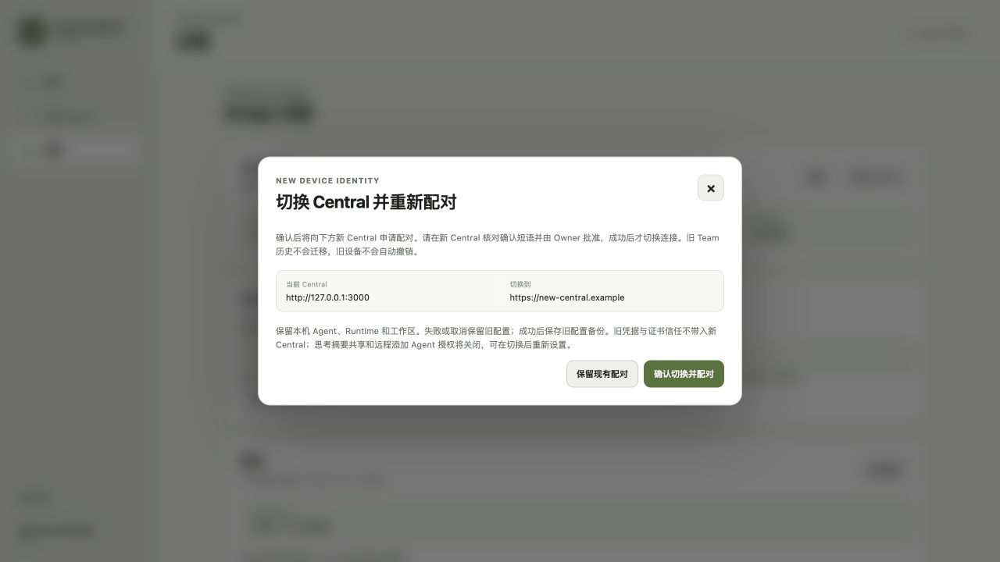

# BRG-069: Client Central switching

Date: 2026-08-31

## Delivered behavior

**Settings → Central connection → Switch Central** accepts a new Central's
complete Device pairing link. The existing **Use pairing link** action and
desktop link activation enter the same review. A different origin is no longer
a permanent rejection: the confirmation displays both addresses and requires
**Confirm switch and pair**. The authenticated local API independently validates
the link, explicit switch consent, expected old origin and paired Device identity.

Pending approval retains the previous selection and displays the new Central
beside the verification phrase. Successful approval selects a fresh sibling data
directory atomically, then starts the Bridge against the new Central. Agent,
Runtime and Workspace profiles stay intact. Old Device/Server credentials, pins,
scoped CA, inbox, Runtime sessions, reasoning-sharing consent and remote Agent
provisioning codes do not cross the origin boundary. Old data and a configuration
backup remain available. This is fresh pairing, not migration of Team history or
automatic revocation of the old remote Device.

## Verification

- `npm run test:bridge-ui`: 54 tests pass, including actual embedded controller
  execution for both entry buttons, explicit confirmation payloads, stale Device
  and origin rejection, proof clearing, configured-unpaired requests and visible
  target approval guidance.
- From `bridge/`, `go test ./...` and `go vet ./...` pass. The new Central-switch
  regressions exercise a real anonymous HTTP claim/poll exchange against a
  disposable different Central, no credential/profile leakage, same-ID namespaces,
  unchanged files before approval, preserved profiles, fresh Agent IDs, backup,
  restart, denied approval, failed backup/credential/activation, wrong returned
  origin, external file changes, cancellation and late completion. Negative HTTP
  tests cover missing/stale consent, authentication, running/draining connections,
  active Runs, Runtime checks and concurrent enrollment.
- `go test -race ./internal/console ./internal/pairing` passes.
- Native macOS `go test -tags desktop ./cmd/convenewire-bridge-desktop` passes.
  The final build uses `MACOSX_DEPLOYMENT_TARGET=12.0` with matching
  `CGO_CFLAGS`/`CGO_LDFLAGS` minimum-version flags.
- Windows amd64 `CGO_ENABLED=0 go build -tags desktop` cross-compilation passes.
- `npm run lint:docs` and `git diff --check` pass.

## Actual page verification

The opt-in `TestPairingBrowserFixture` served embedded production HTML/JS through
the authenticated Console on loopback. Its credentials, approval and connection
are synthetic; no real Central, user binding or Runtime was changed.

The real browser flow confirmed direct Settings entry, different-origin review,
disabled confirmation while running, explicit stop, target-specific approval
guidance, cancellation preserving the old usable binding, and a second approved
attempt selecting the new address with both local Agents retained. No browser
console errors were observed. Fixture servers and the temporary tab were closed.

## Limits

No release or installer was published. The Windows check is cross-compilation,
not physical Windows/WebView2 or installer acceptance. The browser fixture does
not prove live private-DNS/TLS access or Owner approval on the user's server;
existing full pairing trust tests remain the trust regression evidence. No Team
history migration, automatic remote revocation or same-identity server migration
is claimed.
