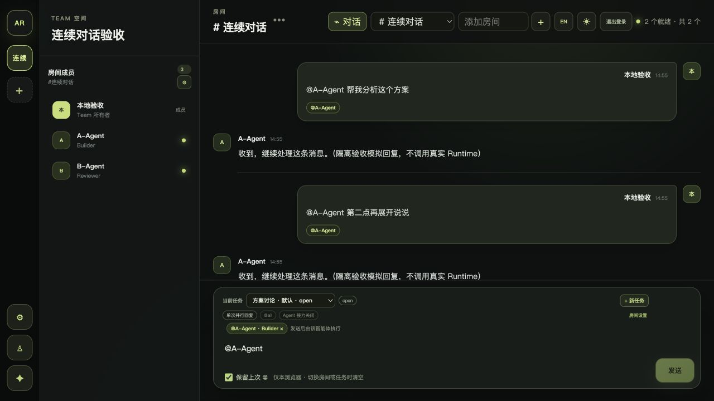
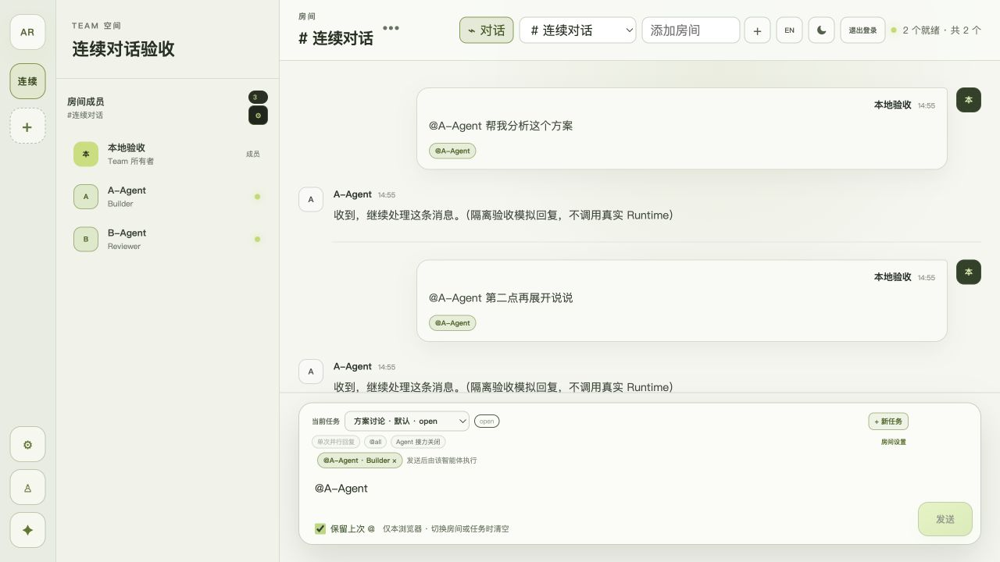
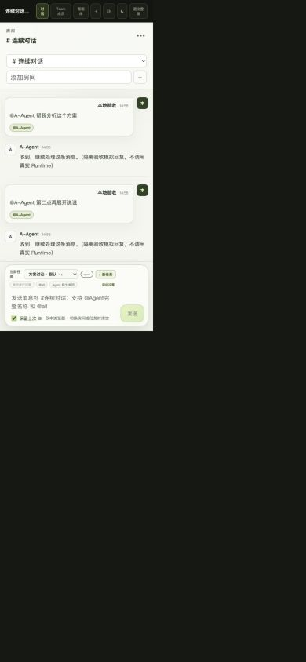

# WEB-041: Opt-in Composer Mention Retention

Date: 2026-08-26.

## Behavior and Boundary

The Room composer now exposes **保留上次 @ / Keep last @ mentions**. It is
off by default. Only the boolean preference is browser-local; recipient IDs,
message text, Server routing, and native Runtime session policy are not stored
or changed by this preference.

An enabled ordinary submission pre-fills visible `@Agent` tokens and removable
stable-ID chips for the next message. Successful Discussion creation does the
same, subject to the existing active-Discussion and participant guards.
Token-only automatic drafts cannot be sent. Turning the switch off removes
only automatic tokens, preserving new text and manually added recipients.
Changing Room, Task, or user clears the draft; removing, disabling, or renaming
a retained Agent removes its old token. Offline presence does not remove it.
`@all` is frozen to concrete recipients, never expanded to new roster members
on a later send. Names containing reserved/embedded expansion syntax are not
automatically pre-filled if they could widen the recipient set.

Failed ordinary messages keep their original payload and client Message ID;
retry never uses or resets newer draft targets. Late Discussion responses are
fenced by both scope generation and draft revision, including Room-away-and-back
and preference-change cases.

## Automated Evidence

- `npm run test --workspace @agent-room/web`: 39 passing tests, including 14
  focused retention cases and the existing full-App onboarding integration.
- `npm test`: all implemented workspace and embedded Bridge UI tests pass.
- `npm run build`: Server, Web, and Contracts builds pass.
- `npm run validate`: 7 schemas and 56 fixtures pass; no wire changes.
- `npm run lint:docs` and `git diff --check`: pass.

The focused cases cover default-off, preference remount, recipient non-persistence,
two-message continuation, token-only guarding, explicit removal/replacement,
turn-off text preservation, Room/Task/user isolation, removed/disabled/renamed
and offline Agents, same-name stable identity, frozen `@all`, original-ID
multi-target retry, Discussion failure/active guards, stale completion, reserved
names, and unavailable/malformed browser storage.

## Browser Evidence

The Browser skill drove the production Web build against an isolated loopback
HTTP fixture with two fake Agents, two Rooms, and two Tasks. This did not change
the user's actual Team data, Bridge configuration, or invoke a real Runtime.

- The visible switch starts off, persists across reload when enabled, and does
  not reload old recipients.
- Two successive messages submit the same `agent_a` and Task identity with
  distinct client Message IDs. The second message uses the pre-filled target.
- The next automatic draft displays `@A-Agent`, its removable chip, and a
  disabled Send button until new message text is entered.
- Turning off retention preserves newly typed Chinese text. Task and Room
  switches clear the recipient while keeping the preference enabled.
- Desktop light/dark layouts remain readable at 1280 x 720, with document
  width 1280 and the composer ending at y=698 (inside the viewport).
- A 390 x 844 same-origin iframe exercises the actual responsive layout; the
  switch, hint, Task selector, and Send action remain inside the composer.
  This is browser layout evidence, not physical mobile-device acceptance.
- The desktop acceptance page reports no application warnings/errors. The
  iframe inspection emitted a MutationObserver error without an application
  source location. Narrow-screen evidence is therefore limited to the rendered
  layout and accessible snapshot rather than a clean-console claim.

## Verification Limits

This is a Web-only interaction change. No central API, protocol, database, Bridge
binary, or Runtime adapter is modified by WEB-041. New real-model or cross-machine
E2E was not run; existing session-resume and transport behavior is not being
re-certified. Local verification does not constitute a published release.
