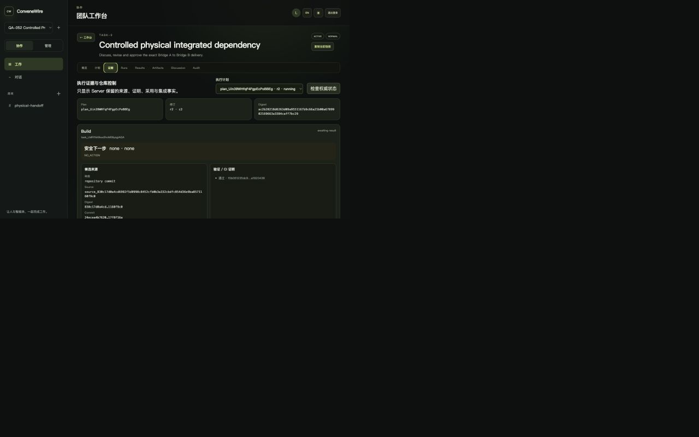
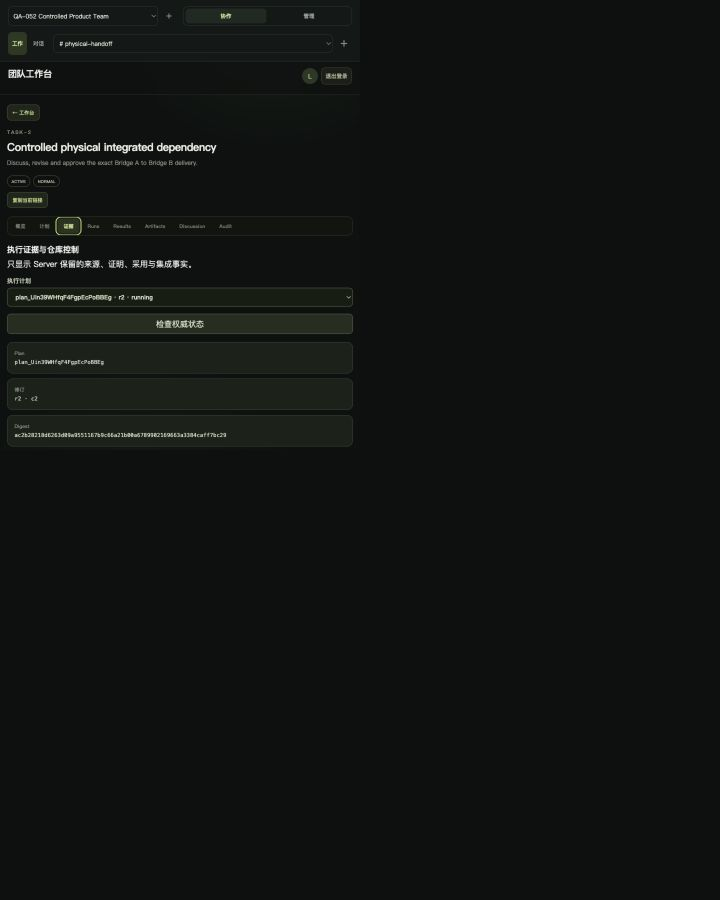
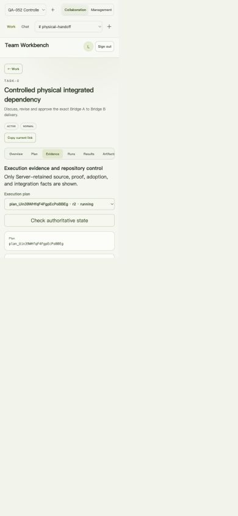
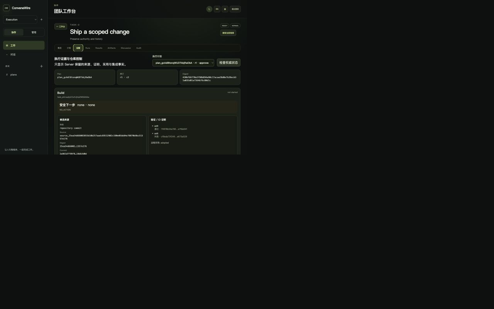
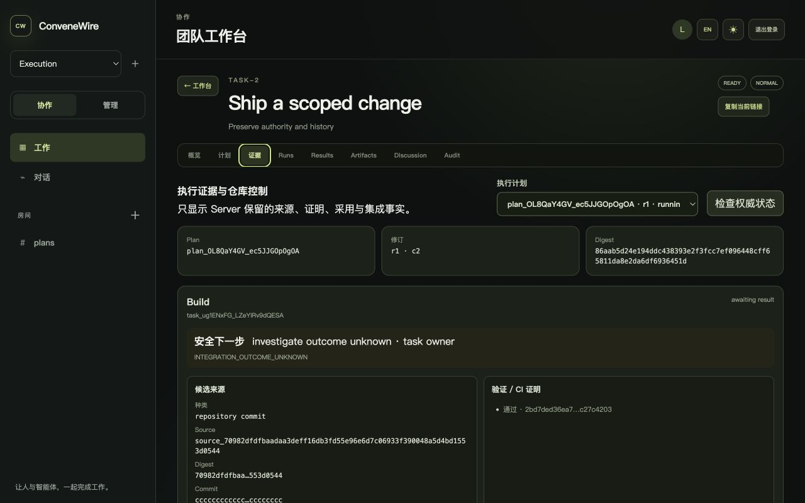

# WEB-064 Proof Control Surface Goal

Status: accepted on 2026-09-03 against the goal frozen before implementation.
`docs/TASKS.md` remains the sole delivery-state register. This goal presents
and controls already delivered verification, adoption and integration
authority; it may not invent proof, infer success or mutate a repository in
the browser.

## Goal

Add one Server-backed **Evidence** surface to the canonical Task detail so a
human can answer, for every current execution node:

```text
where did this candidate come from?
which verification or CI proof was retained?
why is the gate open or closed?
who explicitly adopted or approved it?
what happened to repository integration?
what exact action is safe now?
```

Local Bridge producers and authenticated remote producers share one visual
proof chain:

```text
SourceEvidence
    -> GateProofRef(s)
    -> EvidenceAdoption
    -> NodeMaterialization
    -> IntegrationApproval
    -> IntegrationReceipt
```

The Server owns this projection and every next-action reason. The Web renders
facts and submits explicit commands; a green icon, candidate commit, CI label,
browser role or cached response is never execution authority.

## Authoritative Read Model

Add one bounded, Task-scoped page:

```text
GET /api/tasks/:taskId/execution-evidence?limit=50
```

It first authorizes the current Task Room, then returns only current-revision
plans whose durable `rootTaskId` is the requested Task. Each plan/node entry
must bind:

- plan ID, revision, digest, control revision and state;
- node key, compiled Task, runtime state, blocker, generation and current Run;
- required verification profiles and their exact retained local verification
  or remote CI receipts;
- source evidence kind, origin, commit/tree and ordered sealed Artifact pins;
- every retained adoption with gate, actor/service, proof-set digest and exact
  adoption/source digests;
- integration target, verified materialization, human approval, operation and
  terminal receipt when each exists; and
- one closed next-action code with an owning actor and safe explanation.

The projection excludes credentials, provider response bodies, URLs other than
the already configured public provider origin, local paths, commands, logs,
workspace references and raw SQLite diagnostics. Unknown/corrupt joins fail the
whole affected node closed instead of showing a partial success chain.

## Explicit Commands

The surface may expose two owner-only actions when the Server returns their
exact readiness template:

1. adopt one authenticated remote source as `verified_output`; and
2. approve one local verified candidate for exact-target integration.

Remote adoption binds the current plan revision/digest/control revision,
provider binding, node and source evidence. Integration approval binds the
verified materialization, candidate commit/tree, input digest, ordered
verification receipt pins, target ref and expected target commit. The browser
adds only a stable operation ID and an explicit confirmation; it may not edit
the Server template.

Each command is retained in identity/Task/plan/node-scoped tab session storage
before submission. An unknown network result shows **check authoritative
state** before **retry exact command**. A structured 4xx/409 clears the pending
command; a transport loss keeps it. Selection, plan revision, session, Task or
member changes synchronously hide stale facts and invalidate confirmation.
Storage failure blocks new commands.

The integration operation still executes only on the authorized Bridge. The
Web approval does not run Git, claim the target moved or synthesize a receipt.
Conflict, failure, cancellation and `outcome_unknown` remain retained facts
with different guidance:

| State | Web guidance |
| --- | --- |
| proof missing/failed | inspect the exact profile/receipt; produce new evidence |
| remote adoption ready | owner may explicitly adopt this exact proof set |
| integration approval ready | Task/Team Owner may approve the exact target CAS |
| integration pending | wait for or recover the owning Bridge operation |
| target conflict | refresh/replan; never retry as if the old target were current |
| `outcome_unknown` | inspect the exact target/receipt path; never claim success |
| integrated | show expected, candidate and resulting target commit plus receipt |

## Remote Producer Boundary

REPO-003 remote nodes remain input-free. This surface may display that closed
admission reason but must not provide a bypass for an incoming graph edge.
`REPO-005` owns a future `RemoteInputAttestation` companion that pins both the
exact source adoption authority and the logical input evidence digest. Git
`baseCommit` ancestry alone is insufficient because an input may be a patch,
document, report or test evidence rather than a commit ancestor.

Remote provider credentials remain runtime-only. Web does not configure or
persist them. `SEC-014` owns outbound DNS/address policy before Team Owners can
supply credentials or a live provider adapter may be accepted.

## Interaction And Layout Acceptance

- The canonical Task tab list adds **Evidence** without replacing Plan, Runs,
  Results, Artifacts or Audit.
- Nodes and stages are keyboard navigable and expose text labels in Simplified
  Chinese and English; color and icons are never the only status signal.
- Long IDs/digests wrap or use bounded local scrolling. At 1280, 720 and 390
  pixel widths neither the document nor the Evidence surface overflows.
- Artifact bytes remain behind the existing authorized preview/input paths;
  the proof page shows only immutable pins and explicit inspection links.
- Empty, partially progressed, failed, remote and integrated plans all produce
  truthful distinct states. No synthetic fixture may auto-adopt or integrate
  merely to make the screenshot green.

## Required Evidence

Completion requires:

1. contract fixtures and generated TypeScript/Go round trips for local and
   remote node proof projections, closed next actions and exact command
   templates;
2. Server tests for Task/Room authorization, current-revision scoping, bounded
   ordering, local verification, remote CI/adoption, integration success,
   conflict, failure, `outcome_unknown`, corruption and zero-mutation reads;
3. Web tests for source/proof/adoption presentation, owner-only command
   confirmation, response-loss recovery, exact retry, stale/selection/session
   fencing, safe text rendering, locale/theme and keyboard behavior;
4. a real Server plus production Web browser acceptance at 1280, 720 and 390
   widths covering one local integrated node, one remote adopted node and one
   blocked/recovery state without exposing secrets or local paths;
5. full contracts, Server, Web, workspace build, deterministic E2E and docs
   gates; and
6. three isolated temporary-lifecycle rounds with physical before/after zero
   counts for `agentroom-*`, `agent-room-*`, `convenewire-*` and
   `convene-wire-*`.

## Explicit Non-goals

This goal does not execute verification, mint CI proof, automatically adopt
evidence, run Git, retry a Bridge operation, resolve a target conflict, accept
remote-node inputs, configure provider credentials, add live GitHub/GitLab,
allow remote push/PR merge/webhooks, implement scheduler modes or fairness,
supersede a plan, carry evidence to another revision, or complete QA-053.

## Accepted Delivery

The delivered `ExecutionEvidencePage` contract is one closed, bounded read
model shared by generated TypeScript, Go and runtime validators. The Task-
authorized Server projection joins the current plan revision to local or
remote source evidence, ordered proof pins, explicit adoptions,
materializations, exact-target integration approval/operation/receipt facts
and a Server-owned next action. Draft plans truthfully return no compiled
nodes. Corrupt or mismatched internal joins fail the affected read closed.

The canonical Task detail now has one bilingual **Evidence** tab. It renders
candidate provenance, sealed Artifact pins, local verification or remote CI,
adoption authority and repository integration as separate facts. Owner-only
remote adoption and integration approval use the unchanged Server-prepared
command template, explicit confirmation and identity-scoped `sessionStorage`
receipt. A transport-unknown submission requires an authoritative lookup
before an exact retry. Task, plan, node, member, session or selection changes
fence stale state. The browser never executes verification or Git.

The implementation retained the remote-producer boundary: a remote node with
declared inputs or incoming edges reports
`REMOTE_INPUT_ATTESTATION_REQUIRED`. `REPO-005` owns the future attestation
contract. Provider credentials remain outside this surface, and `SEC-014`
remains the required egress-policy follow-up before owner-configured
credentials or live adapters.

Four issues found while exercising real retained states were fixed rather than
documented away:

- internal plan identity fields no longer leak into a receipt-shaped public
  projection;
- an uncompiled draft no longer violates the evidence-page node contract;
- a retained adopted remote proof outranks a stale failed CI attempt when
  computing the current action; and
- a downstream runtime already blocked by the graph now returns
  `none / none / NODE_BLOCKED` instead of suggesting candidate production.

The changes are split into the independently reviewable commits `99843e6`,
`11dae30`, `3afc861`, `0143b58`, `2a5b325`, `7476e24`, `6d4231d`, `a61c5b3`
and `a6d9ea4`.

## Production Browser Evidence

The browser acceptance used the production Web build against the same
temporary SQLite databases produced by the real authority tests. The only
browser-specific mutation was adding the temporary local browser identity to
the already isolated test Team so it could read the Task. No proof, adoption,
integration approval, receipt or materialization was synthesized for a
screenshot.

The local integrated chain came from the real two-Bridge test and displayed
the repository source, local verification, `verified_output`, exact expected,
candidate and resulting commits, human approval, integration receipt and
`integrated_commit`. The document and Evidence panel measured `1280/1280` and
`964/964` pixels at width 1280, `720/720` and `692/692` at width 720, and
`390/390` and `362/362` at width 390. The narrow English/light-theme node cards
measured `360/360`; only the tab strip used bounded local scrolling.







The remote case came from the authenticated-provider observation test after
real canonical import, CI receipts and explicit Result-free adoption. It
displayed `adopted`, `none / none` and `NO_ACTION`; the 1280-pixel document and
panel measured `1280/1280` and `964/964`.



The recovery case came from a retained `outcome_unknown` integration receipt.
Build displayed `investigate outcome unknown / task owner` with
`INTEGRATION_OUTCOME_UNKNOWN`, while its dependent Consume node remained
`blocked` with `none / none / NODE_BLOCKED`. The 1280-pixel document and panel
again measured `1280/1280` and `964/964`. All three browser cases rejected
visible local paths, grant identifiers and credential tokens.



## Verification Record

The final no-pause and full-suite gates passed on 2026-09-03:

- contracts: 94/94 checks, generated sources current, strict TypeScript and Go
  round trips;
- Server: 545/545 tests;
- Web: 268/268 tests and the production build;
- Bridge: every Go package under `go test ./...`;
- workspace: schema validation for 14 schemas and 258 fixtures plus the full
  workspace build;
- product experience: 2/2 local and trusted-team cases;
- deterministic E2E: 8 passed and the explicitly live-provider-only case was
  skipped; and
- the unpaused focused physical two-Bridge integrated-dependency scenario
  passed in 28.3 seconds.

Every printed suite root was physically absent after completion, including
the final focused two-Bridge root
`/private/tmp/convene-wire-test-run-bxszUv`, full Server root
`/private/tmp/convene-wire-test-run-a9ugyy`, Bridge root
`/private/tmp/convene-wire-test-run-4RABmf` and E2E root
`/private/tmp/convene-wire-test-run-PwU4hz`.

The lifecycle gate then ran `npm run test:temp-lifecycle` three consecutive
times under one private `CONVENE_WIRE_TEST_RUN_BASE`. Each round passed 24/24
success, assertion-failure, spawn-failure, timeout, signal, orphan-process and
parallel-owner cases. For all four names `agentroom-*`, `agent-room-*`,
`convenewire-*` and `convene-wire-*`, every round recorded `before=0` and
`after=0`; the base also recorded `total=0` after each round and was removed at
the end. No real user temporary directory was scanned or cleared.

This acceptance does not claim a live GitHub/GitLab provider, remote incoming-
edge attestation, owner-configured provider credentials, multi-physical-machine
execution, scheduler modes, QA-053 parallel integration or plan
supersession/carry-forward.
